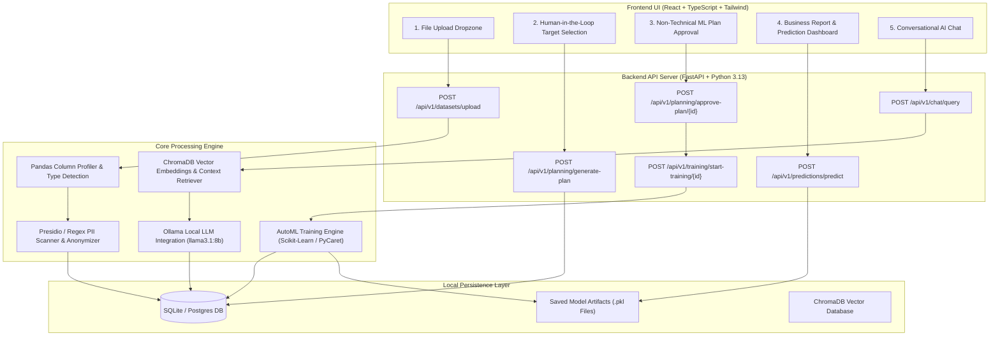

# AI-Powered Conversational AutoML Platform — System Flow Architecture

---

## Detailed Data Processing Flow

1. **Dataset Upload & Anonymization**:
   - User uploads a `.csv` or `.xlsx` file.
   - `DatasetUnderstandingService` profiles columns, detects numerical vs categorical variables, missing values, and potential target candidates.
   - `PIIMaskingService` scans for sensitive PII data (Names, Emails, Phones) and anonymizes them before LLM exposure.
   - Record stored in `datasets` table in SQLite/Postgres DB.

2. **Target Variable Selection & ML Planning**:
   - Target variable is presented to the user (Human-in-the-Loop decision).
   - System auto-generates a non-technical ML plan (Estimated time, selected features, task type, reliability rating).
   - Plan saved in `ml_plans` table.

3. **AutoML Model Training & Selection**:
   - When user approves the plan, `AutoMLEngineService` trains multiple candidate algorithms (Random Forest, Gradient Boosting, Linear Regression, Decision Trees).
   - Evaluates models using cross-validation metrics ($R^2$, RMSE, MAE).
   - Best model is selected and saved as a `.pkl` file in `backend/saved_models/`.
   - Results recorded in `trained_models` table.

4. **Conversational Insights & Vector RAG**:
   - Financial metrics & executive summaries are indexed into ChromaDB.
   - When user asks a chat question, `RAGEngineService` retrieves relevant context embeddings.
   - `OllamaClientService` generates business-friendly advice using local LLM (`http://localhost:11434`).
   - Chat history logged in database.
